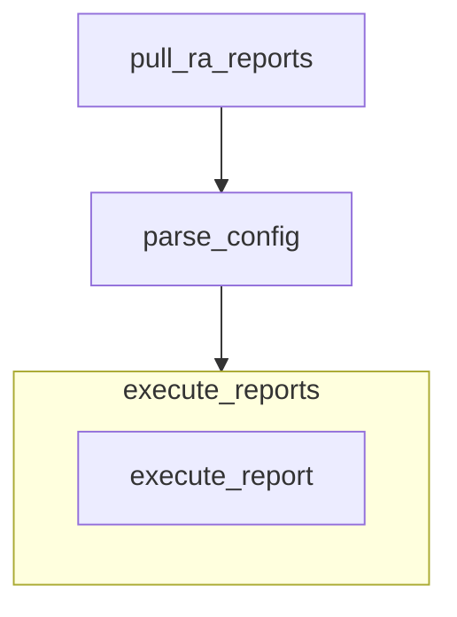
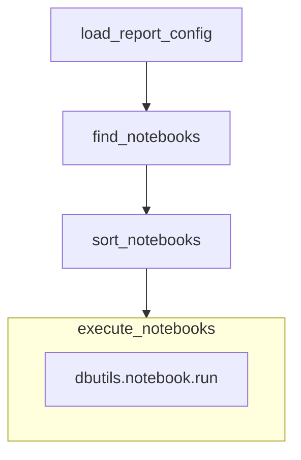

# Generate Reports DM

Execute all active reports.

- Type: Workflow

## Graph

## Tasks

### Pull RA Reports
Pull the reports to the system where they will be executed.

- Type: Task
- Implementation: None
- Input: None
- Output:
    local_ra_reports: Git Repository

### Parse Config
Parse the reports config table to identify

- Type: Task
- Implementation: None
- Input:
    reports_config_path (str): Location of the config table.
- Output:
    active_reports_config (Global Temp View): Dataframe containing active reports.

### Execute Reports
Execute each of the reports in turn.

- Type: For Loop
- Implementation: None
- Looped Task: execute_report

# Execute Report

Run one report.

- Type: Workflow

## Graph

## Tasks

### Load Report Config

- Type: Task
- Input:
    - report_id: (str, "The report to execute.")
    - active_reports_config_view_name: (str, "The name of the global temp view containing the active reports.")
- Output:
    - report_config: (dict, "Config parameters for this particular report.")
- Implementation: None

### Find Notebooks

Walk the directory path to find notebooks that are part of the report.

- Type: Task
- Input:
    - report_dir: (str, "Report directory.")
- Output:
    - notebook_paths: (list[str], "Notebooks in the directory.")
- Implementation: None

### Sort notebooks.

Sort the notebooks into their execution order.

- Type: Task
- Input:
    - notebook_paths: (list[str], "Notebooks in the directory.")
- Output:
    - sorted_notebook_paths: (list[str], "Ordered notebooks in the directory.")

### Execute Notebooks

Execute each notebook in turn.

- Type: For Loop
- Implementation: None
- Looped task: dbutils.notebook.run

# Type Definitions

## Workflow

A series of tasks to complete according to a directed graph.

- graph (str): Mermaid graph sketching out the work flow.
- tasks (list[entity_id]): Tasks to complete.

## Task

- Input (dict[str: (type, str)]): A dictionary of name, input type, and description.
- Output (dict[str: (type, str)]): A dictionary of name, type, and description.
- Implementation (entity_id): None or a reference to the implementation component.

## Attribute
A single attribute, used for e.g. components definitions

- Name (str)